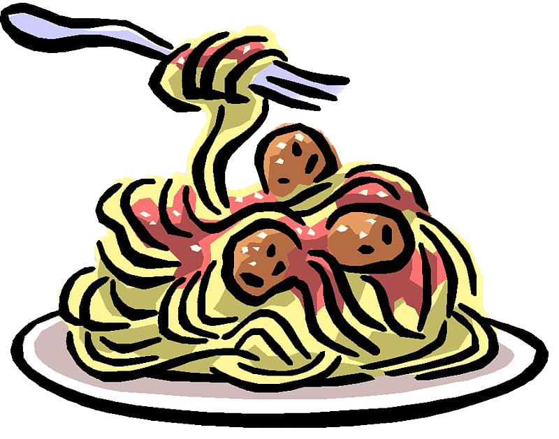

# Project Title

<div style="display" align="center">

</div>

## About <a name = "about"></a>

This project is an introduction to threading and processes, and how to work with shared memory.

### Problem Statement
- Several philosophers are sitting around a round table with a large plate of spaghetti in the center.
- The philosophers can be in three different states: eating, thinking, or sleeping.
- While eating, they cannot think or sleep.
- While sleeping, they cannot eat or think.
- While thinking, they cannot eat or sleep.
- There are as many forks on the table as there are philosophers.
- Since it is not easy to serve and eat spaghetti with just one fork, each philosopher takes the fork on their left and the one on their right, one fork in each hand, in order to eat.
- When a philosopher finishes eating, they put the forks back on the table and start sleeping. Once they wake up, they start thinking again.
- The simulation ends if a philosopher dies of hunger.
- Each philosopher needs to eat and should not die of hunger.
- The philosophers do not communicate with each other.
- The philosophers cannot know if one of them is about to die.

## Getting Started

First, clone the repository:

```` bash
git clone git@github.com:ltrinchini/Philosophers.git
cd Philosophers
````

Then, compile the program by running:
````bash
make
````

## Usage <a name = "usage"></a>

````bash
 ./philo nb_philo time_to_die time_to_eat time_to_sleep [nb_time_each_philo_must_eat]
 ./philo 10 410 200 200 [10]
````

## Technologies Used

- C programming language
- POSIX threads and mutex
